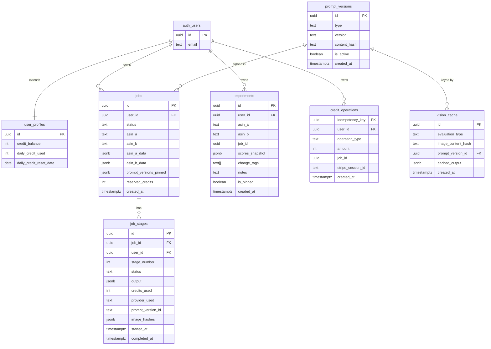

# feat: Build Amazon avatar-based listing optimizer (v5.1 MVP)

## Overview

Build the MVP described in `PROJECT_PLAN_v5.0_HYBRID.md` (document header: Version 5.1, February 2026).

The product compares two Amazon listings (two ASINs) and produces:

- Vision-based CTR evaluation (main image)
- Vision-based PDP/CVR evaluation (gallery images)
- Text alignment evaluation (title, bullets, description)
- Three dynamic buyer personas ("avatars") grounded in reviewInsights
- Deterministic final verdict + prioritized fixes

Key product constraint: optimize for the "magic moment" (avatars + actionable fixes) and strict non-goals (no multi-marketplace, no bulk API, no pixel-perfect Amazon UI, no huge review scraping).

## Problem Statement / Motivation

Amazon sellers struggle to understand why a listing wins (or loses) in a way that is:

- Specific (ties to concrete visual/text elements)
- Fast (progressive delivery within ~70s P95)
- Trustworthy (deterministic scoring, reproducible prompts, golden tests)
- Actionable (clear fix suggestions with evidence)

## Proposed Solution

Implement a hybrid architecture:

- Web: Next.js on Vercel (UI + thin API-route proxies)
- Data/Auth/Realtime/Storage: Supabase (Postgres + Auth magic link + RLS + Realtime + private Storage)
- Compute: FastAPI (API server) + ARQ workers + Redis on Railway

The evaluation pipeline runs as background work on Railway and writes per-stage results to Supabase tables. The UI subscribes to Supabase Realtime for progressive updates and falls back to polling when Realtime fails.

## Repository Research Summary (Local)

### Architecture & Structure

- Current repo is plan-first: `PROJECT_PLAN_v5.0_HYBRID.md`, `Archive/`, `tasks/todo.md`, `.claude/`.
- No `docs/brainstorms/` and no `docs/solutions/` exist yet.
- `.claude/CLAUDE.md` is focused on implementation workflow (write an execution plan into `tasks/todo.md` before coding).

### Issue/Plan Conventions Observed

- Existing planning artifact: `tasks/todo.md` uses checkbox task lists and a "Review" section stub.
- No `.github/` templates or tracker conventions discovered in-repo.

### Recommendation

- Keep this plan as the "issue spec" under `docs/plans/`.
- When ready to execute, derive an implementation checklist into `tasks/todo.md` (per `.claude/CLAUDE.md`).

## Research Decision (External)

This MVP includes high-risk areas (auth, payments/credits, external APIs, data privacy/security). Even though the build spec contains embedded research sections, implementation should still reference current official docs during build.

For this plan file, we will:

- Treat `PROJECT_PLAN_v5.0_HYBRID.md` as the primary spec (local source of truth)
- Include a shortlist of official documentation links for implementation-time verification

## SpecFlow Analysis (User Flows, Edge Cases, Gaps)

### Primary User Flows

1. Sign up / sign in
   Steps: landing page -> enter email -> receive magic link -> complete sign in. Includes email scanner mitigation (landing-page button redirects to the actual magic link).
2. New comparison (happy path)
   Steps: dashboard -> enter two ASINs or Amazon.com URLs -> validate -> create job -> progressive stage results -> final verdict.
3. New comparison (Axesso failure)
   Steps: Axesso/API timeout/not found -> user chooses manual upload fallback -> pipeline proceeds with reduced context.
4. Results consumption
   Steps: user watches stage updates -> sees evidence -> reads avatars -> reviews fixes -> optionally saves experiment.
5. Experiment loop
   Steps: save completed run as baseline -> tag what changed -> re-run -> compare deltas -> pin important experiments.
6. Credits lifecycle
   Steps: show remaining evaluations -> block insufficient credits -> purchase credits via Stripe Checkout -> webhook credits account.
7. Reliability fallbacks
   Fallback A: Supabase Realtime fails -> polling `GET /jobs/{id}/stages`.
   Fallback B: vision provider fails -> automatic fallback OpenAI -> Claude after configured trigger.

### Critical Edge Cases To Specify Upfront

- Duplicate submissions and multi-tab behavior: dedup key must return the same job for 24h, plus explicit "re-evaluate with fresh data" bypass.
- Concurrent credit deductions: must use atomic update + idempotency keys; no double-charges on retry.
- Partial stage failures: per-stage refund rules, no downstream execution when prerequisites fail.
- Realtime ordering: stages 1/2/3 complete out of order; UI must be order-independent.
- Data isolation: RLS must prevent cross-user access for `jobs`, `job_stages`, `experiments`, `credit_*`, and Storage objects.
- PII/secret safety: never log tokens or API keys; structured logging with redaction.

### Open Questions (To Confirm Before Building)

Critical:

- Do we want a monorepo (Next.js + FastAPI + worker) or split repos for Vercel/Railway deployments?
- What is the exact credit pack pricing to launch with (the spec lists multiple examples)?
- What is the MVP posture for account deletion/export (manual is stated; confirm acceptable)?

Important:

- What are the first 5-10 golden test ASIN pairs we will use (categories, expected winners)?
- What admin access model is required for cache flush and observability endpoints?

Nice-to-have:

- Do we want basic analytics events for funnel and latency tracking (job created, stage completed, experiment saved)?

## Technical Approach

### High-Level Architecture

- Next.js UI uses Supabase client (anon key) and RLS for user-scoped reads.
- Next.js server-side/API routes proxy requests to Railway (FastAPI) with `Authorization: Bearer <supabase_jwt>`.
- FastAPI validates Supabase JWT using Supabase JWT secret (server-side env var).
- FastAPI creates jobs, enforces rate limits, reserves credits, and enqueues ARQ jobs.
- ARQ workers execute pipeline stages and write results to Supabase (service role key).
- Supabase Realtime streams `job_stages` updates; UI renders progressive results.

### Data Model (ERD)

This MVP introduces several user-scoped tables and lifecycle tables.

Notes:

- Actual schema details should follow the build spec sections 6, 8, 14, 15, 16, 17, 19.
- RLS policies must use `(select auth.uid())` wrapper and B-tree indexes on user_id columns (per spec).

### Storage Model

- Supabase Storage private buckets for images and archived raw stage payloads.
- Signed URLs (1h expiry) for any direct client access.
- Daily cleanup jobs enforce retention policy (Axesso cache 24h; experiments hot/warm/cold; vision_cache 7d).

## Implementation Phases (A LOT)

### Phase 0: Validate The Magic Moment (Milestone 0)

- [ ] Run the manual pipeline runbook (Section 23 of spec) for at least 1 ASIN pair.
- [ ] Decide Go/No-Go using the spec's checklist (4+ yes to proceed).
- [ ] Save the first golden test record (inputs + expected outputs).

Deliverable:

- Golden test pair #1 documented (proposed file: `golden_tests/golden_pair_001.md`)

### Phase 1: Project Skeleton + Environments

- [x] Decide repo structure (recommended for MVP: monorepo).
- [x] Define top-level folders (proposed).
- [x] `apps/web/` (Next.js).
- [x] `apps/api/` (FastAPI).
- [x] `apps/worker/` (ARQ worker code; may share `apps/api` modules).
- [x] `prompts/` (versioned prompt files).
- [x] `supabase/` (schema, migrations, RLS policies, SQL functions).
- [x] `golden_tests/` (golden test inputs and expected outcomes).
- [x] `docs/` (this plan and future docs).
- [ ] Create Supabase project, enable Auth magic link.
- [ ] Configure Custom SMTP in Supabase (blocker: built-in SMTP is capped).
- [ ] Create Railway services (api, worker, redis) and Vercel project (web).
- [ ] Ensure region co-location (Railway + Supabase same AWS region).
- [ ] Define secrets inventory + rotation schedule (per spec Section 5).
- [ ] Configure baseline security headers (CSP/HSTS on Vercel; CORS locked to Vercel on Railway).

Deliverables:

- Environment checklist doc (proposed file: `docs/runbooks/env-setup.md`)
- Secrets inventory (proposed file: `docs/runbooks/secrets.md`)

### Phase 2: Supabase Schema + RLS Foundation

- [x] Create `user_profiles` and signup trigger (Section 6).
- [x] Create core tables: `jobs`, `job_stages`, `experiments`, `prompt_versions`, `vision_cache`, `credit_operations`.
- [x] Add RLS policies for all user-scoped tables with `(select auth.uid())` and indexes.
- [ ] Configure Storage buckets as private + RLS on `storage.objects` (per spec).
- [ ] Add basic views or helper functions if needed for RLS-friendly stage reads (ex: `job_stages` joined to `jobs.user_id`).

Deliverables:

- SQL migration set (proposed: `supabase/migrations/0001_core.sql`)
- RLS policy doc (proposed: `supabase/rls/README.md`)

### Phase 3: Credits, Idempotency, and Job Lifecycle

- [ ] Implement reserve-execute-settle credit lifecycle (Section 15).
- [ ] Define idempotency key rules for job creation reserve.
- [ ] Define idempotency key rules for stage deductions/refunds.
- [ ] Define idempotency key rules for final settlement.
- [ ] Define idempotency key rules for Stripe webhook crediting.
- [ ] Implement atomic credit deduction pattern (no `SELECT FOR UPDATE`).
- [ ] Implement job deduplication key with 24h TTL and explicit bypass (re-evaluate).
- [ ] Implement daily cap and max credits/run enforcement.

Deliverables:

- Credit operations spec (proposed: `docs/runbooks/credits.md`)

### Phase 4: Data Acquisition (Axesso + Manual Upload)

- [ ] Implement ASIN/URL parsing rules (only amazon.com, reject non-US and short links).
- [ ] Implement Axesso via Apify acquisition in parallel for both ASINs.
- [ ] Immediately download and store images, compute SHA-256 of bytes.
- [ ] Implement 24h Axesso cache per ASIN.
- [ ] Implement manual upload fallback fields and degradation rules (Section 7).

Deliverables:

- Data acquisition contract doc (proposed: `docs/contracts/data-acquisition.md`)

### Phase 5: Pipeline Stages 1-5 + Caching + Fallbacks

- [ ] Stage 1 (Vision CTR) output schema enforcement and evidence minimums.
- [ ] Stage 2 (Vision PDP/CVR) output schema enforcement and evidence minimums.
- [ ] Stage 3 (Text alignment) output schema enforcement.
- [ ] Stage 4 (Avatars) enforce exactly 3 personas and grounding rules.
- [ ] Stage 5 deterministic scoring formula and fix prioritization rules.
- [ ] Implement vision cache keyed by `(image_content_hash + prompt_version + evaluation_type)` with 7d TTL.
- [ ] Implement provider fallback OpenAI -> Claude with trigger (2 consecutive 5xx or >60s timeout).
- [ ] Implement pipeline failure rules and partial refunds (Section 12).

Deliverables:

- Stage output JSON schema definitions (proposed: `apps/api/app/schemas/stages/*.py`)
- Prompt files in repo with SemVer (proposed: `prompts/vision-ctr/v1.0.md`, etc.)

### Phase 6: Progressive Delivery UI + Polling Fallback

- [ ] Implement UI pages from `tasks/todo.md` as the first-pass structure.
- [x] Landing + auth.
- [x] Dashboard.
- [ ] Results loading (stage progress).
- [ ] Results complete (scores, avatars, evidence, fixes).
- [ ] Experiments list/compare.
- [ ] Implement Supabase Realtime subscription to `job_stages` filtered by job_id.
- [ ] Implement polling fallback to Railway `GET /jobs/{id}/stages` (ex: every 5s while incomplete).
- [ ] Ensure stage order independence (stages 1/2/3 arrive in any order).

Deliverables:

- UI flow doc (proposed: `docs/runbooks/ui-flows.md`)

### Phase 7: Stripe Checkout + Webhooks (Credits Purchase)

- [ ] Implement "Buy credits" CTA + checkout session creation.
- [ ] Implement webhook handler and signature verification.
- [ ] Enforce idempotency for webhook replay (store `stripe_session_id` in `credit_operations`).
- [ ] Add credit transaction history view in UI.

Deliverables:

- Billing runbook (proposed: `docs/runbooks/billing.md`)

### Phase 8: Quality Gates, Golden Tests, and Ops Hardening

- [ ] Create golden test suite (5-10 pairs) and enforce as deployment gate.
- [ ] Implement stage-gate tests per stage (spec Section 18) and operational tests.
- [ ] Add prompt integrity checks via content hash.
- [ ] Add worker startup recovery sweep (Postgres authoritative job state).
- [ ] Add cleanup jobs for retention policies and cache TTLs.
- [ ] Add per-stage latency instrumentation and dashboards (P50/P95).
- [ ] Ensure `pip audit` + `npm audit` run in CI.

Deliverables:

- Testing strategy doc (proposed: `docs/runbooks/testing.md`)
- Ops checklist (proposed: `docs/runbooks/ops.md`)

## Acceptance Criteria

### Functional

- [ ] User can sign up and sign in using Supabase magic link with scanner mitigation.
- [ ] User can submit two valid Amazon.com ASINs/URLs and create a job.
- [ ] Stages 1-3 run in parallel and results stream progressively to UI.
- [ ] Stage 4 generates exactly three avatars grounded in reviewInsights (or category fallback).
- [ ] Stage 5 produces deterministic verdict and prioritized fixes with evidence references.
- [ ] Credits are reserved before execution and settled after completion; no double charge on retries.
- [ ] Experiments can be saved, tagged, pinned, and compared.
- [ ] Stripe credit purchase flow works end-to-end with idempotent webhooks.

### Non-Functional / Reliability

- [ ] P95 pipeline completion latency meets spec target (<90s) with progressive delivery (stage render before completion).
- [ ] Realtime failure falls back to polling without losing data.
- [ ] Redis crash does not lose authoritative job state; worker recovery sweep can resume safely.
- [ ] Vision provider fallback triggers correctly and is observable.

### Security / Privacy

- [ ] RLS prevents cross-user access for all user-scoped tables and Storage objects.
- [ ] Railway endpoints reject requests without valid Supabase JWT.
- [ ] Secrets are only in env vars; logs redact sensitive fields.
- [ ] CORS is restricted (Railway accepts only Vercel origin), and Vercel sets security headers.

### Quality Gates

- [ ] Golden tests pass and prevent prompt/model drift (winner stability + score tolerance).
- [ ] All stage output schemas are validated; malformed outputs do not reach UI.
- [ ] Idempotency keys enforce exactly-once credit reserve/refund/settlement semantics.

## Success Metrics (Initial)

Use the spec's metrics (Section 22) as the MVP KPI set, including:

- CTR verdict agreement rate > 80%
- Second simulation within 24h > 40%
- Pipeline completion rate > 95%
- P50 < 40s and P95 < 70s (target), while allowing < 90s P95 hard cap per spec

## Dependencies & Prerequisites

- Supabase project configured (Auth, Realtime, Storage, custom SMTP).
- Railway services configured (api, worker, redis) in same region as Supabase.
- Vercel project configured with env vars and headers.
- OpenAI + Anthropic + Apify accounts and keys, with billing alerts.
- Stripe account for Checkout Sessions and webhooks.

## Risk Analysis & Mitigation

This plan inherits the risk table and mitigations from the spec (Sections 20-21), with key MVP guardrails:

- Golden tests as a hard deploy gate for prompt/model changes.
- Atomic credits + idempotency everywhere.
- Postgres authoritative job state + startup recovery sweep.
- Realtime -> polling fallback.
- Strict RLS, private Storage buckets, signed URLs.

## References & Research

### Internal References

- `PROJECT_PLAN_v5.0_HYBRID.md` (primary build spec)
- `tasks/todo.md` (UI page checklist)
- `Archive/PROJECT_PLAN_v4.0.md` and `Archive/Starting MD Plan Avatar Polling System.md` (historical context)
- `.claude/CLAUDE.md` (execution workflow guidance for implementation phase)

### External References (Verify During Build)

- Supabase Auth / RLS / Realtime / Storage docs (official)
- Vercel Next.js deployment and API route proxying docs (official)
- Railway deployment docs for multi-service apps (official)
- FastAPI docs (official)
- ARQ docs (official)
- Stripe Checkout Sessions and Webhooks docs (official)
- OpenAI and Anthropic model availability and structured output docs (official)
